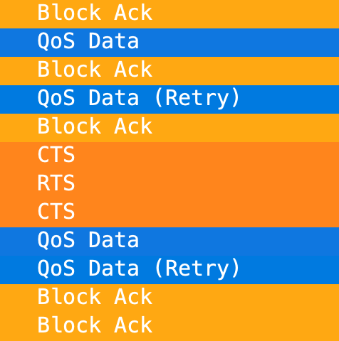
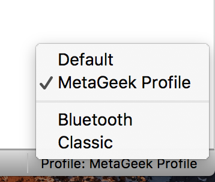

# wireshark-profiles
# Wireshark Profiles

Use this drop-in profile to instantly configure Wireshark for 802.11 packet analysis, or use it as a starting point for your own custom configuration!

## Features
MetaGeek Frame Coloring
Watch 802.11 stations exchange frames! Management frames are colored purple, control frames are orange, and data frames are blue, making frame exchanges super mega easy to track.

### Bad Frame Coloring
Malformed frames and frames that fail checksums are colored red.

### EAP and EAPOL Frame Coloring
See 4-way handshakes and RADIUS exchanges! Cool!

### Frame Sub-Type Column
See frame sub-types in a column!

### Marked Retries
The frame type column marks retries without changing the color. Nice! 

### Hide Frame Types
"Hide Bad", "Hide Data", "Hide Management", and "Hide Control" shortcut buttons mean that there are 4 less regular expressions for you to remember and type. You're welcome!

### AP/Client Conversation Shortcut
Apply the AP/Client Conversation filter, and copy/paste in your AP and client MAC addresses to quickly filter down to a specific conversation.

Replace aa:aa:aa:aa:aa:aa with AP radio MAC address
Replace cc:cc:cc:cc:cc:cc with client MAC address

## Installation Instructions
1. Download the file

2. Unzip the contents, which will be a folder called "MetaGeek Profile"

3. Add the unzipped folder to the "profiles" folder.

*Note: On macOS, you can do this by opening Wireshark, enter CMD+Shift+A, then click directory path on bottom right of dialog box. Copy unzipped folder into profiles folder in that directory*

4. Activate the profile in the lower right corner of Wireshark.

